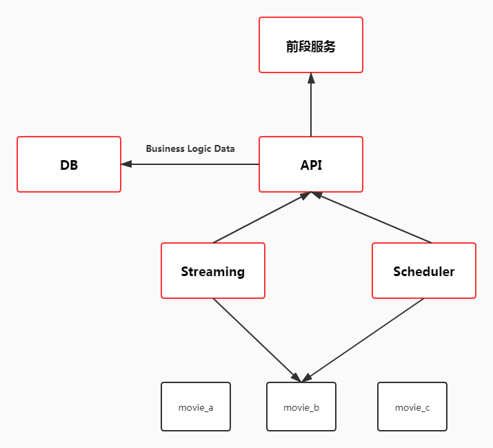
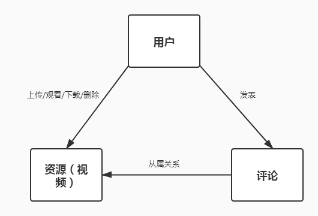

# Go语言实战流媒体视频网站

## 3 流媒体网站架构以及API模块的实现

#### 流媒体点播网站（静态能够播放流媒体的网站）

##### 3-1流媒体网站整体介绍与架构梳理

###### 为什么选择视频网站

- Go是一门网络编程语言（设计模式、设计思想影响io，网络io处理性能优秀，并发模型适合做网络相关的任务处理）
- 视频网站包含Go在实战项目中的绝大部分技能要点（任务调度、在线播放、在线下载，并发模型适合）
- 优良的native http库以及末班引擎（无需任何第三方框架）

###### 总架构图

###### 前后端解耦

- 前后端解耦是时下流行的web网站架构
- 前端页面和服务通过普通的web引擎渲染
- 后端数据通过渲染后的页面脚本调用后处理和呈现

###### 优势

- 解放生产力，提高合作效率（解耦合）
- 松耦合的架构更灵活，部署更方便，更符合微服务的设计特征
- 性能的提升，可靠性的提升

###### 缺点

- 工作量大

- 前后端分离带来的团队成本以及学习成本

- 系统复杂度加大

  

##### 3-2 api设计与架构 （后端服务）

###### API

- REST(Representational Status Transfer) API

- REST是一种设计风格，不是任何架构标准

- 当今RESTful API通常使用HTTP作为通信协议，JSON作为数据格式（天然合法性、便利性）

  ###### 特点

- 统一接口（Uniform Interface）

- 无状态（Stateless）

- 可缓存（Cacheable， 读远大于写的数据）

- 分层（Layered System，）

- CS模式（Client-server Atchitecture）

###### API设计原则

- 以URL（统一资源定位符）风格设计API
- 通过不同的METHOD（GET，POST, PUT, DELETE）来区分对资源的CRUD
- 返回码（Status Code）符合HTTP资源描述的规定

###### API设计

###### API设计：用户

- 创建（注册）用户：URL/user   Method：POST,SC:201(创建成功),400(bad request请求错误),500(内部错误)
- 用户登录：URL:/user/:username  Method:POST,SC:200,400,500
- 获取用户基本信息：URL:/user/:username  Method:GET,SC:200,400,401(验证不不通过返回的错误码，并没有验证),403(验证不不通过返回的错误码，验证不具备操作某项资源的权限),500
- 用户注销：URL:/user/:username Method:DELETE,SC:204,400,401,403,500

##### 3-3 API实现之详细设计

- 222

- 222

- 222

- 222

  

